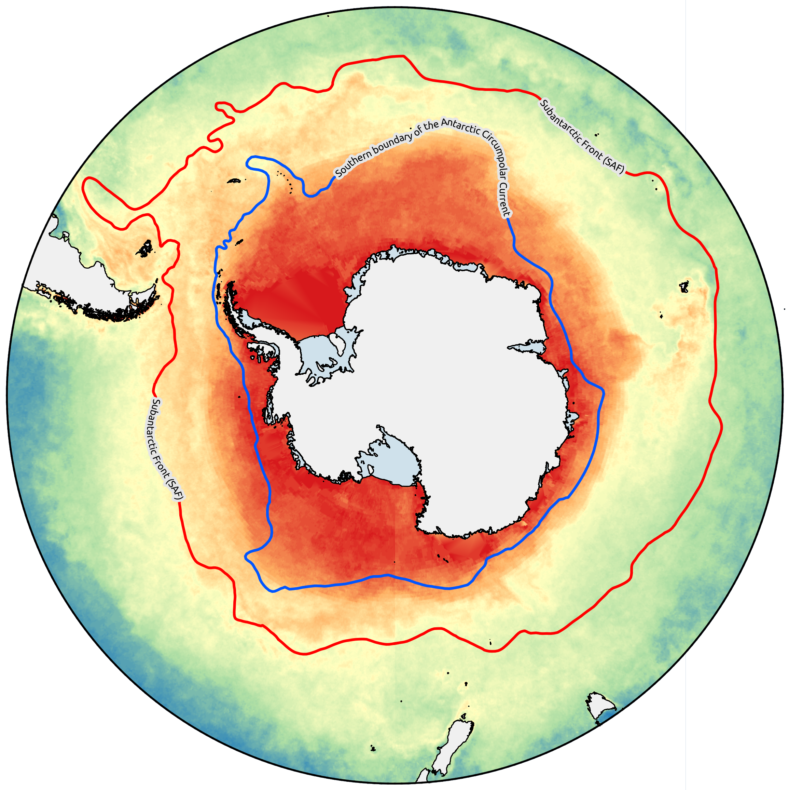
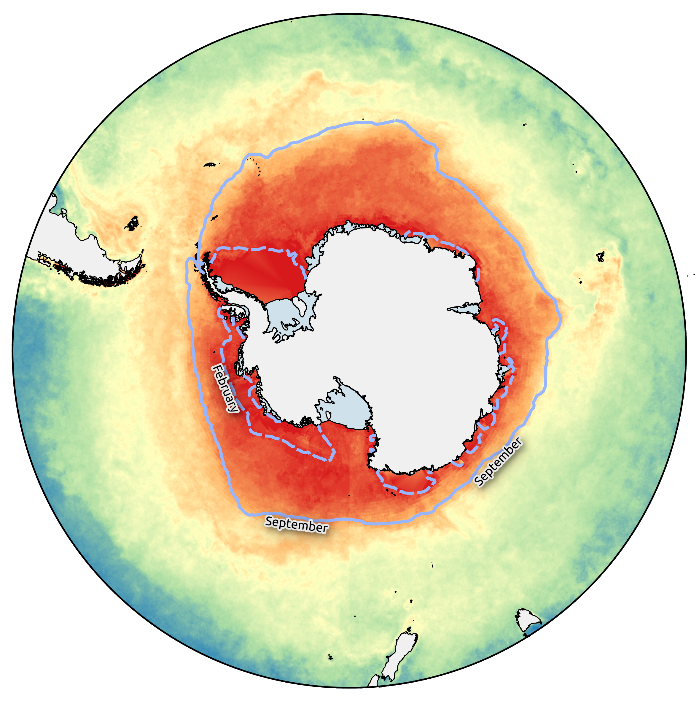

# NPP Normalized Seasonality Index calculator

This repository store the scripts used in the paper "XXX" to calculate the Normalized Seasonality Index (NSI) of the Net Primary Productivity (NPP), following1. This index is computed on the Vertically Generalized Production Model (VGPM), following codes and instructions at the Ocean Productivity website (http://sites.science.oregonstate.edu/ocean.productivity/).

The scripts download, process and calculate the VGPM model from the ancillary data indicated by the Ocean Productivity website, providing a final average NSI index, for the specified time range and decimal coordinates bounding box. Both 8day and monthly data can be processed.

## Table of Contents

- [Installation](#installation)
- [Usage](#usage)
- [Example](#example)
- [License](#license)
- [Contact](#Contact)
- [References](#References)

## Installation

The two scripts, "main" and "vgpm nsi", are written in bash and R respectively, and rely on a limited number of programs and R packages. In order to use the scripts, _GDAL_2 (Geospatial Data Abstraction Library), _GNU parallel_ and the R packages _tidyverse_3 and _parallel_4 must be installed. The scripts must be run from the bash terminal, after assuring that R can be run from it.

## Usage

The scripts can be run at once by navigating to a directory that must include both scripts and the data sub-directory, which will store the two files "manifest", with the list of http links to the ancillary data for chlorophyll, photosynthetically active radiation and sea surface temperatures, and "region_coord", a tsv file with the bounding box for the geographical region of interest. After editing both files as interested (if monthly data are required modify the manifest list including "month" instead of 8day in each link), the scripts can be run with this command:

	bash -i main.sh 8day		# change the argument to "month" if monthly data are required

Two tsv files will be obtained at the end of the analyses, one including latitude, longitude and the NSI for each year at each point (final.tab) and another including only the average NSI for the entire years range (b_isnpp.tab).

Multiple methods can be adopted to produce a raster file for further analyses. For this paper, a kriging interpolation was performed using SAGA CMD5, based on the 12 nearest points. The tsv file was first imported in QGIS6 and then exported as a shapefile. The interpolation was performed on the command line using this code.

	saga_cmd statistics_kriging 0 -POINTS b_isnpp.shp -ZFIELD b.isnpp -TQUALITY 0 -SEARCH_POINTS_ALL 0 -SEARCH_POINTS_MIN 4 -SEARCH_POINTS_MAX 12 -TARGET_USER_SIZE 0.08 -TARGET_DEFINITION:0 -TARGET_USER_XMIN -179.916666667 -TARGET_USER_XMAX 179.916666667 -TARGET_USER_YMIN -78.583333333 -TARGET_USER_YMAX 84.083333333

## Example

The image below was obtained by running the scripts on 8day data from 2009 to 2011 and choosing the following geographic bounding box:

| region | minlon | maxlon | minlat | maxlat |
| -------- | -------- | -------- | -------- | -------- |
| antarctica | -180 | 180 | -80 | -40 |

This image was produced using QGIS6 and the package Quantarctica7, by applying a TIN interpolation. The blue and red lines are two of the major oceanographic fronts, estimated from observed temperature and salinity data8.

Here, the same raster file of NSI values is overlapped by the monthly median sea ice extents for the period 1981-20109 of September (solid line) and February (dashed line).

## License

You are free to modify and use this script in your projects. If you use this script, we kindly request you to cite our paper as follows:

[Author(s)]: "Title of the Paper," Conference/Journal Name, Year. [DOI or URL](link to the paper)

## Contact

Inquiries can be forwarded to matteocecchetto@gmail.com

## References

1 - Brown, C. W., Schollaert Uz, S. & Corliss, B. H. Seasonality of oceanic primary production 		and its interannual variability from 1998 to 2007. Deep Sea Res. Part Oceanogr. Res. Pap. 90, 166–175 (2014).

2 - GDAL/OGR Contributors. GDAL/OGR Geospatial Data Abstraction Software Library. (2022).

3 - Wickham, H. et al. Welcome to the {tidyverse}. J. Open Source Softw. 4, 1686 (2019).

4 - R Core Team. R: A Language and Environment for Statistical Computing. (2022)

5 - Conrad, O. et al. System for Automated Geoscientific Analyses (SAGA) v. 2.1.4. https://gmd.copernicus.org/preprints/8/2271/2015/gmdd-8-2271-2015.pdf (2015) doi:10.5194/gmdd-8-2271-2015.

6 - QGIS Development Team. “QGIS Geographic Information System.” Open source geospatial foundation project, 2023. http://qgis.osgeo.org.

7 - Matsuoka, Kenichi, Anders Skoglund, George Roth, Jean de Pomereu, Huw Griffiths, Robert Headland, Brad Herried, Katsuro Katsumata, Anne Le Brocq, and Kathy Licht. “Quantarctica, an Integrated Mapping Environment for Antarctica, the Southern Ocean, and Sub-Antarctic Islands.” Environmental Modelling & Software 140 (2021): 105015.

8 - Alejandro H. Orsi, Thomas Whitworth III, and Worth D. Nowlin Jr (1995), On the meridional extent and fronts of the Antarctic Circumpolar Current., Deep-Sea Research, 42, 5, 641-673 

9 - Fetterer, F., K. Knowles, W. Meier, M. Savoie, and A. K. Windnagel. 2016, updated daily. Sea Ice Index, Version 2. [Indicate subset used]. Boulder, Colorado USA. NSIDC: National Snow and Ice Data Center. doi: http://dx.doi.org/10.7265/N5736NV7.