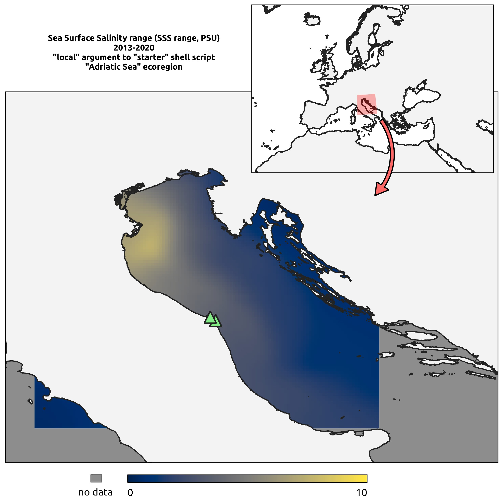
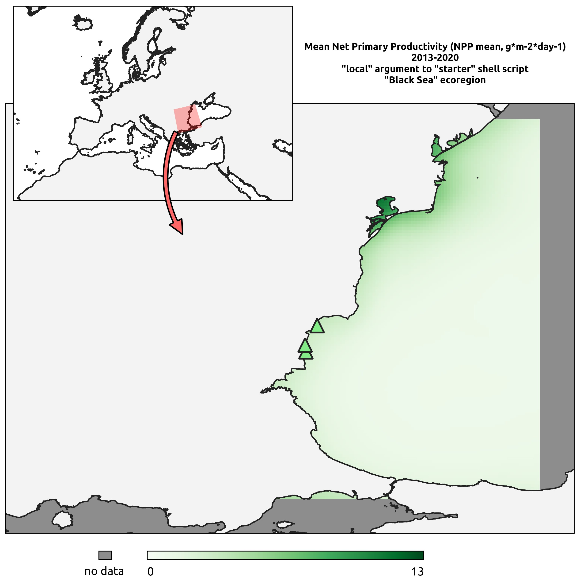
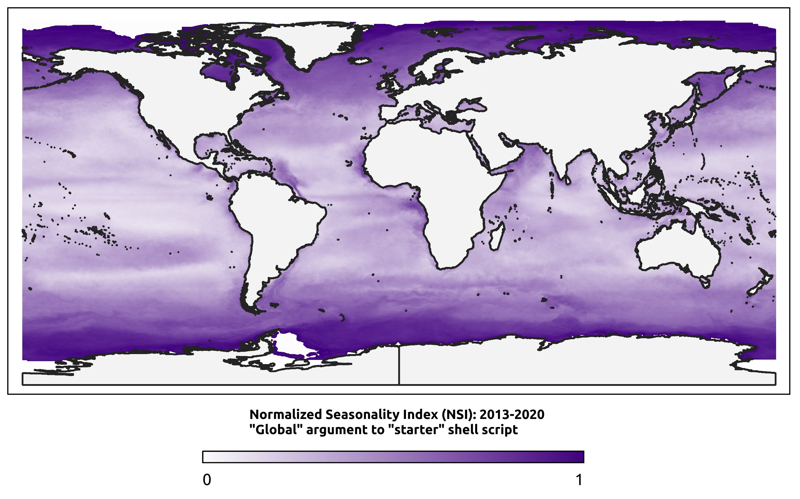
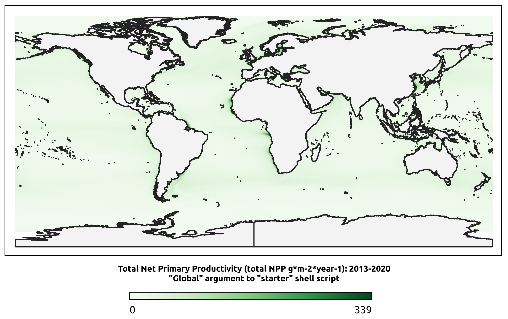

# Environmental Data download from MODIS and Copernicus

This repository stores the scripts used in the paper from Cecchetto et al.1 "Seasonality of primary production explains the richness of pioneering benthic communities" to download satellite data corresponding to Sea Surface Salinity, Sea Surface Temperature, Diffuse Attenuation coefficient, Photosynthetic Available Radiation and calculate the Normalized Seasonality Index for seasonality of NPP, following Brown et al.2. This index is computed on the Vertically Generalized Production Model (VGPM), following codes and instructions at the Ocean Productivity website (http://sites.science.oregonstate.edu/ocean.productivity/).

The scripts download satellite data, process and calculate the VGPM model from the ancillary data indicated by the Ocean Productivity website, providing a final average NSI index, for the specified time range, as well as the other environmental variables previously mentioned.

It works on daily data from Copernicus and 8-day MODIS data, and can download produce long-term averages and range values for a single or multiple time ranges. If not specified otherwise, the scripts produce environmental data for the samples' locations included in the dataset in Cecchetto et al.1. 

## Table of Contents

- [Installation and requirements](#installation and requirements)
- [Usage](#usage)
- [Example](#example)
- [License](#license)
- [Contact](#Contact)
- [References](#References)

## Installation and requirements

The two main scripts, "env\_download.sh" and "env\_process.R", are written in bash and R3 (version 4.3.3) respectively, and rely on a limited number of programs and R packages. In order to use the scripts, _GDAL_4 (Geospatial Data Abstraction Library, version 3.8.4), _GNU parallel_5 (version 20161222) and _SAGA_6 (command line version 9.4.0), as well as the R packages _tidyverse_7, must be installed. The scripts must be run from the bash terminal, after assuring that R can be run in interactive mode from it.

Cloning this repository in a local directory will copy all required files in a directory called "scripts". All commands must be run in the parent directory.

A variety of additional scripts and files allow to properly process the satellite data:

- the directory "gdal\_scripts" include additional python scripts from the same version of GDAL and allow different operations on shapefiles. 

- "grid\_ref" includes the shell scripts that will allow to produce "no\_data" small regions at the corners of the Mercator world projection and help merge correctly the satellite data.

- "support\_files" allows to create shapefiles from scratch.

- "shapefiles\_global" includes the Global, Self‐consistent, Hierarchical, High‐resolution Shoreline database8 (GSHHS), used to remove satellite points falling on land.

## Usage

The scripts can be run using the "starter.sh" shell script:

	bash -i scripts/starter.sh "local"

This script will search for a text file named "yearrange", which will include the entire years range used to download satellite data. This is how the text file should look like, as used for the analyses in Cecchetto et al.???:

	2013-01-01|2021-01-01

The script will download the satellite data and process it to obtain long-term averages and ranges for the time periods specified in another text file, "timeframes", which necessarily must be included in the time range provided with the text file "yearrange". If not provided, the timeframes file will be created using the contents of "yearrange".

The scripts will produce different directories and remove data as soon as it is processed, to free up space.

At the end of the analyses, raster tif files will be found in the "variables/tif" directory.

Interpolation will be performed following a kriging interpolation at 0.04 degrees of cellsize. 

If the first argument to the "starter.sh" script is "local", the raster files will be created only for the locations included in the dataset found in Cecchetto et al.???.

If the first argument is "global", then the interpolation will be performed at the global scale, after subdividing the satellite data in different regions.

## Example

The images below were obtained by running the scripts on "local" from 2013 to 2020, and depict Sea Surface Salinity ranges and Net Primary Productivity mean for the Adriatic and Black sea, respectively.

The images below were obtained by running the scripts on "global" from 2013 to 2020, and show the Seasonality Index (NSI) and Total Net Primary Productivity.

Coastlines were obtained from the Global, Self‐consistent, Hierarchical, High‐resolution Shoreline database8 (GSHHS), while maps were created in QGIS9.

## License

You are free to modify and use this script in your projects. If you use this script, we kindly request you to cite our paper as follows:

Cecchetto, M., Dettai, A., Gallut, C. et al. Seasonality of primary production explains the richness of pioneering benthic communities. Nat Commun 15, 8340 (2024). https://doi.org/10.1038/s41467-024-52673-z

## Contact

Inquiries can be forwarded to matteocecchetto@gmail.com

## References

1 - Cecchetto, M., Dettai, A., Gallut, C. et al. Seasonality of primary production explains the richness of pioneering benthic communities. Nat Commun 15, 8340 (2024). https://doi.org/10.1038/s41467-024-52673-z

2 - Brown, C. W., Schollaert Uz, S. & Corliss, B. H. Seasonality of oceanic primary production 		and its interannual variability from 1998 to 2007. Deep Sea Res. Part Oceanogr. Res. Pap. 90, 166–175 (2014).

3 - R Core Team. R: A Language and Environment for Statistical Computing. (2024)

4 - GDAL/OGR Contributors. GDAL/OGR Geospatial Data Abstraction Software Library. (2022).

5 - Tange, Ole. "GNU Parallel 20201122 ('Biden')." November 2020. Zenodo. DOI: 10.5281/zenodo.4284075. https://doi.org/10.5281/zenodo.4284075

6 - Conrad, O. et al. System for Automated Geoscientific Analyses (SAGA) v. 2.1.4. https://gmd.copernicus.org/preprints/8/2271/2015/gmdd-8-2271-2015.pdf (2015) doi:10.5194/gmdd-8-2271-2015.

7 - Wickham, H. et al. Welcome to the {tidyverse}. J. Open Source Softw. 4, 1686 (2019).

8 - Wessel, P. & Smith, W. H. F. A global, self‐consistent, hierarchical, high‐resolution shoreline database. J. Geophys. Res. Solid Earth 101, 8741–8743 (1996).

9 - QGIS Development Team. “QGIS Geographic Information System.” Open source geospatial foundation project, 2023. http://qgis.osgeo.org.
